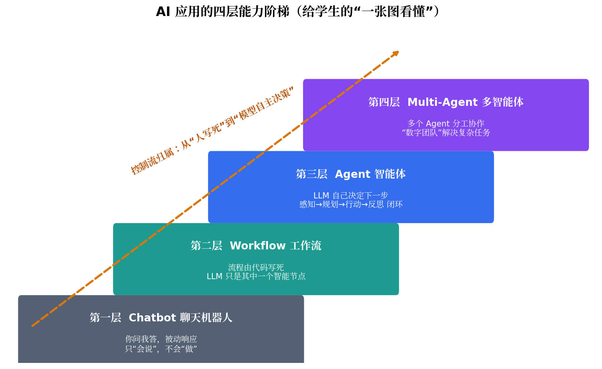
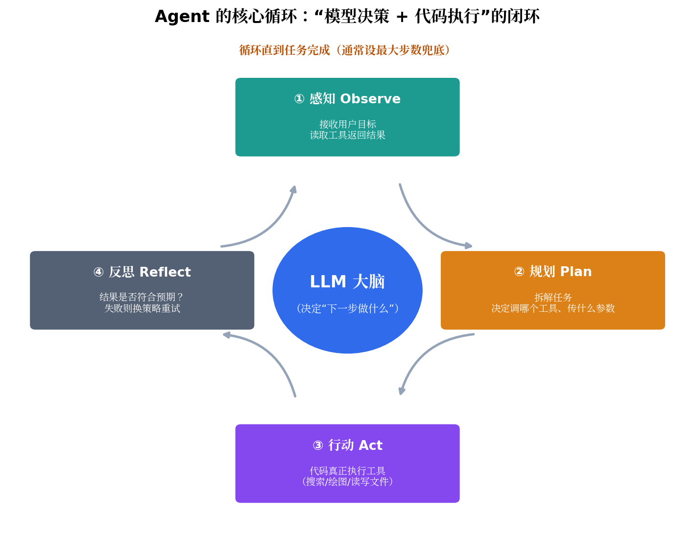
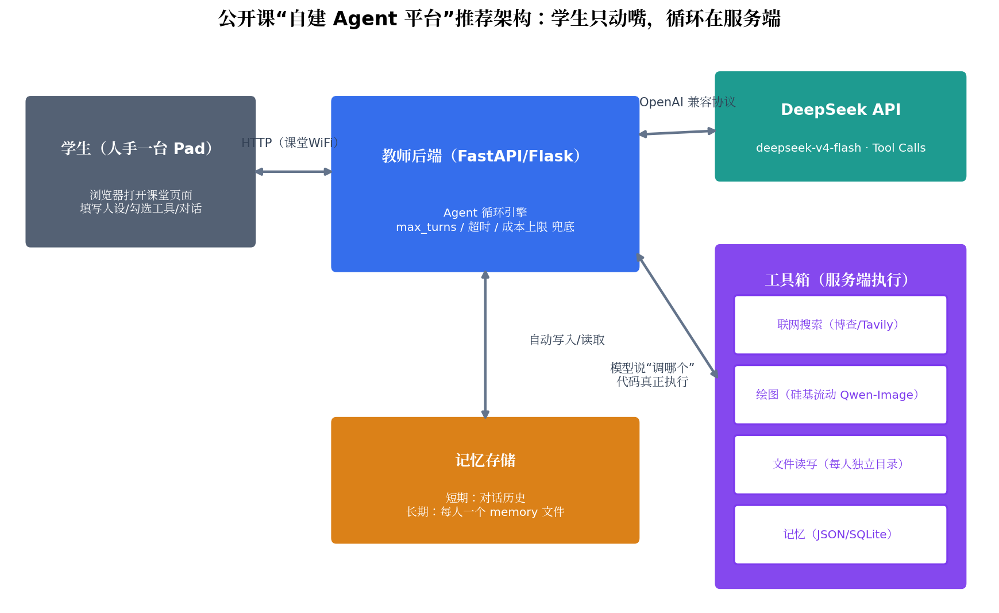
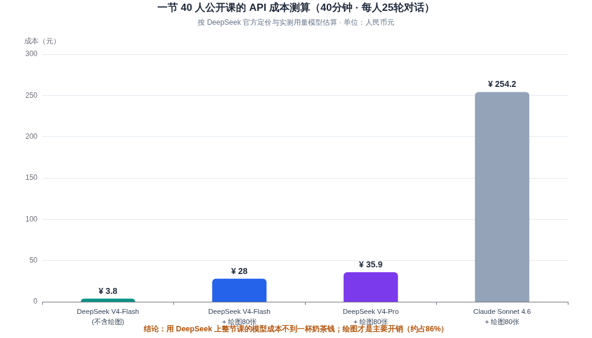

# 从"会说话"到"会做事"：Agent 概念辨析与高中公开课自建 Agent 平台可行性调研报告

> **TL;DR（先说结论）**
>
> **问题一：Agent 和之前的"智能体"差在哪？** "智能体"不是新词，但今天的 Agent 和过去的规则式智能体（自动客服、专家系统、脚本机器人）有一条本质分界线——**控制流归谁所有**：过去的智能体走人事先写死的流程，今天的 Agent 由大模型在运行时自己决定"下一步做什么、调哪个工具、什么时候停"。Anthropic 官方把这条线划为 Workflow（预定义代码路径编排 LLM）与 Agent（LLM 动态指挥自身流程与工具使用）之别[^8^]。给学生的最佳讲法是**四层能力阶梯**：Chatbot → Workflow → Agent → Multi-Agent[^13^]。多智能体协同不是"多开几个聊天窗口"，而是"一个大脑（编排者）+ 多个专才（工作者）"的分工架构，配套两个正在标准化的协议：MCP 管"Agent 怎么接工具"、A2A 管"Agent 怎么找同事"[^51^][^52^]。
>
> **问题二：用 DeepSeek API 自建课堂 Agent 平台，可行吗？** **完全可行，且比想象中简单便宜。** DeepSeek 官方 API 原生支持 Tool Calls（工具调用），deepseek-v4-flash 单账号并发上限 **2500**——40 个学生同时用毫无压力[^42^][^43^]。你点名的四类工具全部能实现：**文件操作**（服务端 Python 直接读写，最容易）、**网站访问**（接博查/Tavily 等搜索 API）、**自动记忆**（对话历史 + 每人一个记忆文件，几十行代码）、**图片生成**（DeepSeek 自身没有绘图 API，需接第三方如硅基流动 Qwen-Image，每张约 ¥0.3）[^82^]。按一节课 40 人 × 25 轮对话测算，**整节课模型成本约 ¥4，加上绘图总成本约 ¥28**。现成的框架（LangGraph、CrewAI）和低代码平台（Dify、扣子）都存在，但对"让学生理解 Agent 原理"这个教学目标而言，**自研一个极简平台（约 300~500 行代码）反而教学价值最高**——因为学生能看到循环的每一行。

---

## 一、概念篇：把 Agent 讲明白的三条主线

### 1.1 "智能体"一词并不新：今天的 Agent 和"之前的智能体"差在哪

"智能体（Agent）"在人工智能教材里是个有几十年历史的老词：凡是能感知环境并采取行动的实体都叫智能体——自动扶梯的感应控制器、棋类程序、银行的规则式客服机器人，都算。所以课堂上一定会遇到学生问："Siri、快递客服机器人不是早就有了吗，现在的 Agent 新在哪？" 这个问题值得正面回答，因为它是理解整场技术变革的钥匙。过去的智能体本质上是**规则驱动**的：工程师把业务拆解成标准作业程序（SOP），写成 if-else、决策树或固定脚本，系统严格执行预设流程，一旦环境超出预设规则就束手无策——"它如流水线上的工人，严格执行预设流程却无力应对突发异常"[^67^]。它们的知识库是静态固化的，更新需要重新编程；它们的交互是一对一、简单响应式的；它们能处理的只有封闭、确定性的任务[^79^]。

新一代 LLM Agent 的本质变化，是用大语言模型替换掉了"规则引擎"这个决策核心，完成了从**规则驱动到认知驱动**的范式转移[^67^]。行业分析普遍将其归纳为三个新增的"认知器官"：**规划能力**——把复杂目标拆解为可执行的子任务序列，并根据环境反馈动态调整；**多层次记忆系统**——当前会话的工作记忆、历史交互的情景记忆、固化知识的语义记忆，支撑长期上下文理解与个性化适应；**工具使用能力**——根据任务需求自主调用搜索引擎、计算器、专业软件 API 等外部工具，极大扩展能力边界[^79^]。于是工作流程从"线性固定"变成了"动态闭环"：理解开放模糊的自然语言指令 → 动态规划 → 自主选工具执行 → 基于结果反思优化 → 输出个性化方案，形成"感知-规划-行动-反思"的完整循环[^67^]。这场变革的产业量级可以参考一个数字：高德纳预测到 2026 年将有 40% 的企业应用嵌入任务型 AI 智能体，而 2025 年这个比例还不足 5%[^67^]——这正是"Agent 元年"之类说法的来源，也是你公开课导入环节可以直接引用的素材。

| 对比维度 | 传统（规则式）智能体 | LLM Agent |
|---|---|---|
| 决策核心 | 人工编写的规则引擎 / 决策树 | 大语言模型（认知大脑）[^67^] |
| 任务理解 | 只能处理封闭、确定性的指令格式 | 理解开放、模糊的自然语言，适应未见场景[^79^] |
| 知识更新 | 静态固化，更新需重新编程 | 预训练知识 + 联网/RAG 实时整合，知识"常青"[^79^] |
| 流程形态 | 线性固定流程（SOP），遇异常易中断 | 动态闭环，能根据反馈自我反思调整[^67^] |
| 能力边界 | 限于预置的有限功能 | 自主调用外部工具，边界随工具扩展[^79^] |
| 协作方式 | 一对一简单交互 | 支持多智能体分工协作的"数字团队"[^79^] |

### 1.2 权威分界线：Workflow 还是 Agent？——控制流归属

如果你想给这节课找一个"学术上站得住、评委挑不出错"的概念锚点，那就是 Anthropic 在官方指南《Building Effective Agents》中划定的架构分界线。这篇文章是 2024 年底发布、至今仍被业界引用最频繁的 Agent 工程指南，它的核心贡献是把所有"Agent 系统（agentic systems）"分成两类：**Workflow 是"LLM 和工具通过预定义代码路径编排"的系统；Agent 是"LLM 动态指挥自身流程和工具使用、对如何完成任务保持控制权"的系统**[^8^]。一句话概括：**控制流由谁决定——代码写死就是 Workflow，模型运行时决定才是 Agent**[^3^]。一个特别实用的判别句式可以直接搬到课件上："能不能在 LLM 运行之前就画出完整流程图？能 → Workflow；不能 → Agent"[^3^]。

这条分界线还有一个反直觉但极有价值的推论，非常适合在公开课上呈现"批判性思维"：Anthropic 明确反对"Agent 是 Workflow 的高级版、什么都该做成 Agent"的流行误解，其建议是**"能用单次 LLM 调用解决的不要用 Workflow，能用 Workflow 解决的不要用 Agent"**[^8^]。原因是 Agent 的自主性伴随着真实的代价：token 消耗不可预知（可能 3 步完成也可能 30 步没完）、行为不确定难复现、错误会随步数复合放大、需要设置最大步数/成本上限/超时三条兜底线[^3^]。真实的工程事故案例很有课堂感染力：某客服 Agent 上线第一周就出了三个事故——退款跳过人工审批、在"查订单→查物流"之间循环调用 12 次、猜错用户意图调错工具，根因不是模型不够强，而是"这个场景根本不需要 Agent"[^3^]。生产实践中的主流形态其实是**混合架构（Agentic Workflow）**：主干用 Workflow 保证可控，只在需要灵活判断的节点嵌入 Agent[^2^]。这种"先问是否真的需要自主性"的克制，恰恰是学生应该建立的工程观。

| 维度 | Workflow（工作流） | Agent（智能体） |
|---|---|---|
| 控制流 | 开发者预定义的代码路径[^8^] | LLM 运行时动态决策[^8^] |
| 类比 | 照菜谱做菜：每步预先定好 | 经验丰富的厨师：看冰箱里有什么再决定做什么[^4^] |
| 可预测性 | 高，同样输入走同样路径 | 低，路径动态生成[^9^] |
| 成本 | 调用次数固定、可预算 | 不可预知，可能 2 步也可能 50 步[^9^] |
| 调试 | 像调试普通后端程序 | 像调试一个随机系统[^9^] |
| 适用任务 | 步骤可预知、可靠性要求高 | 开放性问题、步数无法预知、需要灵活应对意外[^5^] |
| 工程要求 | 常规测试即可 | 必须设 max_turns、成本上限、超时兜底 + 沙箱测试[^8^] |

### 1.3 给学生的一堂课：四层能力阶梯

综合 Anthropic 的分界线和业界的演进叙事，给学生最友好的认知框架是"四层能力阶梯"——它把抽象的概念之争变成一条看得见的进化路线[^13^]：

**第一层是 Chatbot（聊天机器人）**：负责对话问答，用户问一句它答一句，比如知识问答、客服咨询，不需要复杂执行能力[^13^]。**第二层是 Workflow（工作流）**：流程固定、步骤清晰，比如"用户上传图片→去背景→换颜色→保存→返回"，适合用程序控制流程而不是让模型自己决定下一步[^13^]。**第三层是 Agent**：关键特征是它不按完全固定的路线执行，而是根据环境反馈动态调整，基本循环是 observe → think → act → observe——先观察当前状态，再思考下一步，然后采取行动，最后观察行动结果，不符合预期就调整策略再来[^13^]。**第四层是 Multi-Agent**：多个 Agent 协作，一个负责需求分析、一个负责技术方案、一个负责测试、一个负责安全审查[^13^]。这个阶梯还天然携带一个重要的价值判断，可以作为课堂讨论题："不要一上来就追求 Agent 或 Multi-Agent。能用 Chatbot 解决的就不要上 Workflow，能用 Workflow 解决的就不要上 Agent，能用单 Agent 解决的也不要轻易上 Multi-Agent"[^13^]——技术的层级不等于价值的高低，匹配场景才是关键。

这个框架落到课堂互动上有一个很顺的设计：让学生现场判断身边的 AI 应用分别属于哪一层。小爱同学定闹钟是 Chatbot 还是 Workflow？扣子平台上搭的"作业批改机器人"是 Workflow 还是 Agent？Manus、Devin 这类产品为什么敢叫 Agent？判断标准就一条——"它下一步做什么，是人写死的，还是模型自己决定的"。这个问题没有标准答案的争议部分（比如很多产品介于两层之间）恰好是最好的讨论素材，因为 Anthropic 自己也承认"Agent 可以有多种定义"，业界把所有变体统称为 agentic systems[^8^]。吴恩达教授的观点也可以作为拓展：他认为这些都属于 Agent，只是分配给系统的灵活度、可控度不同，像一个滑动窗口，预定义代码路径只是这个窗口的最小值[^18^]。

### 1.4 多智能体协同："一个大脑 + 多个专才"，而不是"多开几个聊天窗口"

多智能体协同是学生最容易产生科幻式误解的概念（想象成几个 AI 坐在一起聊天开会），所以更需要用架构语言讲清楚。目前最主流的多智能体架构是 **Orchestrator-Worker（编排者-工作者）模式**：Orchestrator 是"大脑"，负责理解任务、制定计划、分配工作、汇总结果；Worker 是"手脚"，各司其职专注执行某一类具体任务[^45^]。一个具体可感的例子是 Claude Code：主 Agent 负责写代码、编辑文件、运行命令，同时在后台派子 Agent 去搜索大型代码库或调查独立问题，每个子 Agent 有自己的上下文窗口，返回精炼后的发现，主 Agent 的上下文因此保持聚焦[^44^]。另一种是 **Pipeline（流水线）模式**：各 Agent 串行执行，上一个的输出是下一个的输入，像工厂流水线，适合"收集数据→清洗→分析→可视化"这类有明确先后依赖的任务[^45^]。角色分工上，常见的四类角色是规划者（Planner，任务分解与策略制定）、执行者（Worker，具体执行）、审阅者（Reviewer，检验与改进结果）、协调者（Orchestrator，分派任务与最终决策）[^48^]。

多智能体系统的核心挑战可以归纳为三件事：**分工**（如何把任务合理分配给不同 Agent）、**通信**（Agent 之间如何传递信息）、**协调**（如何确保行动一致且高效）[^56^]。围绕"通信"这一环，2025 年以来出现了两个正在标准化的协议，建议点到为止地介绍：**MCP（Model Context Protocol，模型上下文协议）** 由 Anthropic 于 2024 年底推出，解决的是"Agent 如何以统一方式连接工具和数据源"——把它想象成 AI 应用的 USB-C 接口，正如 USB-C 让设备用统一方式连接各种外设，MCP 让 AI 模型用统一方式连接不同的数据源和工具[^58^]；**A2A（Agent2Agent 协议）** 由 Google 于 2025 年 4 月推出、现由 Linux 基金会托管，解决的是"不同厂商、不同框架构建的 Agent 之间如何互相对话协作"，核心组件是 Agent Card（描述一个 Agent 能力与接口的"数字名片"）[^51^]。用一句课堂语言总结两者关系：**MCP 像"工具使用说明书"，教 Agent 用工具；A2A 像"同事沟通指南"，教 Agent 找同事——两者不是竞争而是互补**[^52^]。最后需要给学生（和你自己）一个清醒剂：Anthropic 的多智能体实践原则里明确写着"多智能体架构的复杂性会导致执行任务并输出结果的成本急剧上升"，多 Agent 之间的沟通、协调、成本和不确定性都会增加[^13^][^54^]——多智能体是"必要时才用的高级形态"，不是默认选项。

| 编排模式 | 结构 | 角色关系 | 适用场景 | 代表实现 |
|---|---|---|---|---|
| Orchestrator-Worker（编排者-工作者） | 中心调度 + 并行执行 | 一个"组长"规划、分配、综合；子 Agent 各做一摊[^45^] | 任务可并行拆分、子任务边界清晰，如"调研竞品+写报告+生成PPT"[^45^] | Claude Code 的子 Agent[^44^] |
| Pipeline（流水线） | 串行：A→B→C | 上一个的输出是下一个的输入[^45^] | 有明确先后依赖的加工流，如"研究→写作→校对"[^45^] | 内容生产流水线 |
| Evaluator-Optimizer（评估-优化循环） | 生成者 + 评估者闭环 | 一个生成、一个评审，循环到达标[^4^] | 代码 Review、文案打磨[^4^] | Anthropic 五种 Workflow 模式之一[^4^] |
| 平级协作（Peer-to-Peer） | Agent 间直接通信 | 地位平等、频繁对等交互[^56^] | 需要多方协商的开放任务 | AutoGen 对话式协作[^22^] |

### 1.5 回到你的困惑：扣子（Coze）在 Agent 版图中的位置

你说"之前用过扣子，感觉现在的 Agent 理念要强过扣子"——这个直觉基本正确，可以用 1.2 节的分界线精确解释。扣子的官方定位是字节跳动推出的**零代码 AI 应用开发平台**，目标是"非技术人员也能快速搭建和部署对话式 AI 应用"，通过丰富的插件生态与一站式托管让轻量级 AI Bot 的发布极为快捷[^29^]。它的本质是"**零代码画板 + 插件拼装**"：你在画布上配置好人设、知识库、插件和（可选的）工作流，平台托管运行[^33^]。用四层阶梯来定位：扣子上搭出来的大多数 Bot 处于**第一层到第二层之间**——控制流主要由平台预设和（你画出来的）工作流决定，LLM 是流程中的智能节点。它不是不能做出 Agent 形态（勾上插件、开启多 Agent 模式后可以呈现一定的自主工具调用），但它的设计哲学是"把不确定性关在笼子里"，这与"模型在驾驶座上"的 Agent 理念确实是两种取向。

对你来说，这个差异恰恰是公开课的最佳切入点：**扣子把 Agent"藏"起来了，而你要做的自建平台把 Agent"拆开来"给学生看**。在扣子上，学生看到的是"我配置了一个机器人"；在你的平台上，学生能看到"模型返回了一个 tool_call → 我的代码执行了搜索 → 结果喂回模型 → 模型继续决策"的完整循环——后者才是理解 Agent 原理的路径，也是"学生自己实现一个小 Agent"这个教学目标所要求的。两者的关系可以这样向学生表述：扣子是"组装好的玩具"，今天我们要做的是"看清发动机怎么转"。此外还有一个务实的定位分工：扣子/Dify 适合学生课后快速做出能用的作品（C 端分发、低门槛），自建平台适合课堂上的原理教学[^33^]。下表把几个代表性选项放在一起对比，供你在"现成 vs 自研"之间权衡：

| 方案 | 本质 | 控制流归属 | 学生能看到什么 | 适合你的场景吗 |
|---|---|---|---|---|
| 自建极简平台（DeepSeek API + Python/Go） | 手写 Agent 循环 | 完全由你的代码编排，可展示"模型决策"的每一步 | **完整可见**：tool_call 请求、工具执行、结果回传 | ★ 公开课首选：教学价值最高，成本约 ¥30/节课 |
| 扣子 Coze | 零代码 Bot 画板，云端 SaaS 托管[^33^] | 平台预设 + 可视化工作流为主 | 只能看到配置界面和最终对话 | 适合课后作品孵化，不适合讲原理 |
| Dify（开源自托管） | 低代码 AI 应用开发平台，完整复刻 Coze 核心能力[^27^] | 可视化工作流为主，支持 MCP/A2A[^27^] | 流程图可见，但引擎内部仍是黑盒 | 适合想私有化部署、做复杂应用的进阶场景 |
| LangGraph / CrewAI 等代码框架 | 封装好的 Agent 编排库[^22^] | 代码可控，但框架抽象层较厚 | 取决于封装程度，容易被框架细节淹没 | 适合你备课参考，不适合直接搬进 40 分钟课堂 |

---

## 二、工程篇：用 DeepSeek API 自建课堂 Agent 平台，可行性有多高

### 2.1 底座核验：DeepSeek API 官方能力清单（以官方文档为准）

先给结论：**DeepSeek API 是目前国内最适合课堂场景的 Agent 底座之一**，理由有三。第一，**工具调用是官方一等公民能力**：官方文档提供完整的 Tool Calls 指南，API 与 OpenAI 格式完全兼容（直接用 openai SDK、把 base_url 指向 `https://api.deepseek.com` 即可），思考模式与非思考模式均支持工具调用，Beta 渠道还提供 strict 模式，保证模型输出的工具调用严格遵循你定义的 JSON Schema[^42^]。第二，**并发额度对课堂极其友好**：官方明确按账号限制并发数，deepseek-v4-flash 为 **2500**、deepseek-v4-pro 为 **500**，超出才返回 429；40 个学生同时操作的峰值并发不过几十，连零头都用不到，而且如需更高并发还可免费申请扩容[^43^]。第三，**价格低到可以忽略**（详见 2.6 节测算）：v4-flash 每百万 token 输入 $0.14、输出 $0.28，且有自动上下文缓存机制——重复的系统提示词和工具定义命中缓存后输入价降到 $0.0028/百万，课堂上所有学生共享同一套系统提示词和工具定义，缓存命中率会非常高[^41^]。

需要注意的边界同样来自官方信息。一是**模型阵容已换代**：当前官方文档在售的是 DeepSeek-V4-Flash 与 DeepSeek-V4-Pro 两个模型，上下文均为 1M、最大输出 384K，均支持 JSON 输出与 Tool Calls；旧的 deepseek-chat / deepseek-reasoner 调用名正在退役，新代码应直接使用新模型名[^41^]。二是**DeepSeek 没有图像生成能力**：V4 系列发布时官方定义集中在长上下文、Agent 能力与推理性能三件事上，缺乏原生多模态生成是明显短板[^77^]；图像理解（识图）已在 2026 年逐步上线，v4-pro 支持在消息中传入图片做理解分析[^69^]，但"文生图"需要第三方 API（见 2.3 节）。三是**API 没有内置联网搜索工具**：官方 Tool Calls 文档的示例明确写着"get_weather 函数的功能需要由用户提供，模型本身不执行具体函数"[^42^]——联网搜索、绘图、文件操作都要你自己的代码实现或接入第三方服务，这恰恰是下一节要讲透的教学点。

| 项目 | deepseek-v4-flash | deepseek-v4-pro |
|---|---|---|
| 定位 | 高速轻量，课堂首选 | 更强推理，支持图片输入（多模态理解）[^69^] |
| 上下文 / 最大输出 | 1M / 384K[^41^] | 1M / 384K[^41^] |
| Tool Calls | ✓（含 strict 模式 Beta）[^42^] | ✓（含 strict 模式 Beta）[^42^] |
| 输入价（每百万 token） | $0.14；缓存命中 $0.0028[^41^] | $0.435；缓存命中 $0.003625[^41^] |
| 输出价（每百万 token） | $0.28[^41^] | $0.87[^41^] |
| 账号并发上限 | **2500**[^43^] | **500**[^43^] |
| 图像生成 | ✗（需第三方 API） | ✗（需第三方 API） |

### 2.2 一个必须在课堂上讲透的认知：模型从不"执行"工具

整个 Agent 技术体系里最适合做成"课堂顿悟时刻"的知识点，是 DeepSeek 官方文档示例里那句不起眼的注释："get_weather 函数的功能需要由用户提供，**模型本身不执行具体函数**"[^42^]。学生对 Agent 最大的迷思是"AI 自己会查天气、会画图、会开网页"，而真相是：**模型只负责说"调用哪个函数、传什么参数"，真正干活的是你的代码**[^2^]。一次典型的工具调用循环是四步：用户问"杭州天气怎么样"→ 模型返回结构化请求 `get_weather({location: 'Hangzhou'})` → 你的代码真正去调用天气服务、拿到结果 → 结果以 tool 角色消息喂回模型，模型再用自然语言回答"杭州现在 24℃"[^42^]。这个循环跑通一次，学生对"Agent 是什么"的理解就超过了绝大多数只会用现成产品的成年人。

这个认知的教学价值还在于它自然引出 Agent 的另外两根支柱。业界常把 Agent 概括为"三支撑"：**工具调用**（配好 get_weather、send_email 两个工具后，Agent 会分两步真实执行"查天气→发邮件"，而非假装执行）、**记忆**（传统 LLM 每次对话"失忆"，Agent 显式设计短期记忆存中间状态、长期记忆存用户偏好与历史操作，保证复杂任务中连贯不跑偏）、**多步推理与自纠**（执行失败能感知并换路重试，像一个真正在思考的执行者）[^2^]。普通 LLM 的硬局限可以用一句话演示给学生看：你让裸模型"帮我发一封天气播报邮件"，它只能告诉你"你可以这样写代码……"，它不会主动查 API、组织内容、调发信接口——哪怕多轮对话，也只是在当前上下文里被动响应[^2^]。把这句话做成课堂对照实验（同一个任务，裸模型 vs 你的 Agent 平台各跑一次），就是公开课最亮眼的五分钟。

### 2.3 四类工具逐项评估：文件、绘图、联网、记忆

你点名的四类工具，工程难度从"几十行代码"到"接一个第三方 API"不等，全部落在一位会借助 AI 辅助编程的老师 1~2 个周末的工作量内。这里的关键设计原则是：**所有工具都在服务端执行，学生的 Pad 只是一个浏览器入口**——这样既没有学生机环境差异问题，也把 API Key、文件系统权限、内容安全全部收拢在你能控制的地方。四个工具中唯一需要额外注册第三方服务的是绘图和联网搜索，都有国内直连、带免费额度的方案。记忆功能最容易被低估，建议认真做：让学生第一节课告诉 Agent"我叫什么、我喜欢什么"，第二节课发现它"还记得"，是体验冲击力最强的设计，而实现不过是每轮对话后把要点追加写入一个 JSON 文件、下次对话时注入系统提示词。

| 工具 | 可行性 | 实现方式 | 工作量 | 注意事项 |
|---|---|---|---|---|
| **文件操作** | ★★★★★ 最容易 | 服务端 Python `pathlib` 读写；给每名学生建独立目录（如 `workspace/student_01/`），工具函数只允许在该目录内读写 | 30~50 行代码 | 务必做路径白名单校验，防 `../` 越界；课堂结束可打包下载学生的作品文件 |
| **网站访问/联网搜索** | ★★★★ 接 API 即可 | 国内首选**博查搜索**：专为大模型/Agent 设计，国内直连稳定、中文搜索质量好、个人免费额度充足，Dify/Coze 已内置其插件[^91^]；备选 **Tavily**（Agent 生态最广，每月免费 1000 次，但国内访问偶有波动，建议加重试）[^86^] | 一次 HTTP POST 封装成 tool | 免费额度按"全班一节课"估算绰绰有余；对返回结果做截断，避免撑爆上下文 |
| **图片生成** | ★★★★ 需第三方 | DeepSeek 无文生图 API[^77^]；推荐**硅基流动**：国内直连、兼容 OpenAI 格式、新用户有免费额度，Qwen-Image 约 $0.042/张（≈¥0.3），中文文字渲染能力业界领先[^82^][^85^] | 一次 HTTP POST 封装成 tool | 40 人 × 2 张 ≈ ¥24，是一节课的最大单项成本；可对提示词做课前内容过滤 |
| **自动记忆** | ★★★★★ 纯代码 | 短期记忆 = 本轮对话的 messages 列表（天然就有）；长期记忆 = 每轮结束后让模型提炼"值得记住的事实"追加到该学生的 `memory.json`，下次对话注入系统提示词 | 50~80 行代码 | 进阶可选 mem0 等现成记忆库，但课堂场景手写反而更有教学透明度；DeepSeek 官方还提供 user_id 参数做用户级隔离，可用于内容安全管理[^43^] |

四类工具之间还有一个值得在设计上利用的化学反应：**工具是可以串联的，而串联的决策者正是模型自己**。比如"查资料 → 把要点存成文件 → 根据要点画一张插图 → 把插图和文件路径一起汇报给用户"这个链条，不需要你写任何流程代码——只要四个工具都在工具清单里，模型会在 Agent 循环中自己决定先调搜索、再调文件写入、再调绘图。这正是 1.2 节"控制流归属"最直观的课堂证据：同样的四个工具，勾选与否、如何组合，产生的能力天差地别，学生拨动工具开关时实际上是在亲手划定自己 Agent 的能力边界。需要预先防范的是组合调用带来的步数膨胀——每多串联一个工具就多一次模型往返，课堂版把 max_turns 设在 5~8 步可以在体验和成本之间取得平衡。

### 2.4 有没有现成的？——有，但"现成"和"适合教学"是两回事

现成方案分三层，都值得你备课时参考，但定位各不相同。**第一层是代码框架**：LangGraph（状态图式编排，可控可恢复，适合复杂流程）、CrewAI（角色制多智能体，抽象直观、上手快）、OpenAI Agents SDK（轻量，Handoff 交接 + Guardrails 护栏是一等公民）、AutoGen（多智能体对话协作，但已进入维护模式，新项目需谨慎）[^22^][^38^]。框架的问题对课堂来说很一致：抽象层太厚——学生在 `Agent(role=...)` 一行配置里看不到循环，你被框架的配置细节淹没，40 分钟里解释框架本身就要花掉一半时间。**第二层是低代码平台**：Dify 是目前国内使用量最高的开源 Agent 平台，完整复刻了 Coze 的核心能力（可视化工作流、RAG、插件市场），100% 开源可自托管，且原生兼容 MCP、支持 A2A 智能体互调[^27^]；扣子则是零门槛的云端 SaaS[^33^]。它们适合"做产品"，不适合"讲原理"。**第三层是 MCP 生态**：文件系统、网页抓取等工具都有现成的开源 MCP Server，如果你的平台想快速扩充工具箱，接 MCP 比手写工具更省事[^49^]。

给你的具体建议是**"自研主平台 + 借框架思想 + 留扣子做彩蛋"**：自研一个极简平台（FastAPI/Flask 后端 + 一个移动端友好的网页，核心 Agent 循环约 100 行代码）作为课堂主阵地；备课时读 LangGraph/CrewAI 的文档吸收编排思想（比如 Supervisor 模式）用于你的多智能体演示环节[^48^]；课堂结尾留 3 分钟展示"同样的 Bot 在扣子上 3 分钟就能搭出来并发布到飞书/抖音"，让学生理解"原理"与"工程产品"的关系——这个对照本身就是很好的总结升华。如果你时间紧，还有一个折中方案：先用 AI 辅助生成平台代码（你学生都是这么写代码的，你也完全可以），把省下的时间花在设计"学生可配置的旋钮"上——人设提示词、勾选工具清单、记忆开关、最大步数，这四个旋钮就是学生"自己实现一个小 Agent"的操作界面。

### 2.5 推荐架构与课堂工程清单

推荐架构如上图，技术选型一句话：**Python + FastAPI（或 Flask）+ 一个移动端友好的单页面前端，部署在学校能访问的一台服务器/云主机上，学生 Pad 浏览器直接访问**。你提到 Go 也可以——Go 的 goroutine/channel 天然适合表达多智能体的并发与消息通信，有教程专门用 Go 讲多智能体系统[^64^]，但课堂原型阶段 Python 的生态（openai SDK、丰富的示例）更省事，建议 Python。并发方面完全不用担心：40 个学生的 HTTP 请求对你的后端是小流量，对 DeepSeek 的 2500 并发上限更是零头[^43^]。真正需要提前做的是**兜底三件套**：max_turns（建议课堂版设 5~8 步，防止循环调用烧 token）、单次会话成本上限、超时返回——这是 Anthropic 指南强调的生产教训，也可以在课堂上作为"工程思维"知识点讲给学生[^3^]。

内容安全与课堂管理是公开课评委一定会关注的点，给你一份清单：**API Key 只存在服务端**，前端永远接触不到；利用 DeepSeek 官方的 user_id 参数给每名学生传独立标识，实现内容安全的用户级隔离与追溯[^43^]；学生输入和绘图提示词过一遍关键词过滤（可用模型自己做前置审核，一次调用成本可忽略）；每名学生独立工作目录 + 独立记忆文件，互不干扰；课前用 5 名学生量的真实压测跑一遍全流程；准备一个"离线兜底"——把课前录好的平台操作演示视频存本地，万一网络波动，课还能照常上。最后提醒一个细节：DeepSeek 的思考模式（thinking）会产生较长的思维链、拖慢响应，课堂互动环节建议用非思考模式保证响应速度，演示"Agent 的推理过程"时再切换到思考模式让学生看到模型"怎么想"[^41^]。

### 2.6 成本与并发测算（定量）：一节课 ≈ 一杯奶茶钱

按如下保守假设测算一节 40 分钟、40 名学生的课：每人与 Agent 对话 25 轮，每轮平均触发 3 次模型调用（含工具调用回环），每次调用约 1800 token 输入（系统提示 + 工具定义 + 对话历史 + 工具返回）与 350 token 输出。总计约 **3000 次调用、5.4M 输入 token、1.05M 输出 token**。由于全班共享同一套系统提示词与工具定义，按 70% 缓存命中率估算，DeepSeek v4-flash 的模型成本为 **¥3.8**；加上每人 2 次绘图（硅基流动 Qwen-Image，$0.042/张）的 ¥24.2，**一节课总成本约 ¥28**[^41^][^82^]。作为对照，同样的用量如果调用 Claude Sonnet 4.6（$3/$15 每百万 token），仅模型成本就约 ¥230[^20^]。联网搜索方面，博查个人免费额度对一节课的检索量足够，Tavily 每月 1000 次免费额度同样够[^86^][^91^]。

| 成本项 | 用量假设 | 单价 | 小计 |
|---|---|---|---|
| 模型调用（v4-flash） | 3000 次调用，5.4M 输入 / 1.05M 输出，70% 缓存命中 | $0.14/$0.0028/$0.28 每百万 token[^41^] | **¥3.8** |
| 图片生成 | 40 人 × 2 张 | $0.042/张[^82^] | **¥24.2** |
| 联网搜索 | 全班合计 <200 次 | 免费额度内[^91^] | **¥0** |
| 服务器 | 一台 2C4G 云主机即可 | 已有或约 ¥1/小时 | ≈¥2 |
| **合计** | | | **≈ ¥30/节课** |

---

## 三、把调研结论变成一节 40 分钟的公开课（设计建议）

基于上述调研，给你一版可直接打磨的教学流程建议。**0~5 分钟·导入**：对照实验——同一个任务"查一下今天本市天气，写成 50 字播报并画一张配图"，先让裸 DeepSeek 对话窗口做（它只能说"我无法查询实时天气"），再让你的 Agent 平台做（现场看它调搜索、调绘图、组织语言）。提问："同样是这个模型，差别在哪？"引出"三支撑"[^2^]。**5~12 分钟·概念**：用四层阶梯图讲 Chatbot→Workflow→Agent→Multi-Agent，落到判别金句"它下一步做什么，是人写死的还是模型自己决定的"[^3^][^13^]；现场让学生举例子归类（小爱同学、快递客服、扣子 Bot、Manus）。**12~17 分钟·拆机器**：展示你平台的后台日志——一条 tool_call 的 JSON 长什么样，讲透"模型从不执行工具，代码才执行"[^42^]，这是全课的知识锚点。

**17~32 分钟·动手（公开课的核心互动）**：学生在 Pad 上打开平台，完成"四个旋钮"——写人设（"你是一个____，你的任务是____"）、勾选工具（搜索/绘图/文件/记忆）、设最大步数、然后开始对话完成任务。设计 2~3 个梯度任务卡：基础任务（"查一个你感兴趣的知识点并总结存成文件"）、进阶任务（"让 Agent 记住你的喜好，新开对话考它记没记住"）、挑战任务（"让它边查边画，产出一张带图的知识卡片"）。教师巡视时重点捕捉两类瞬间用于点评：学生发现"勾选不同工具，同一个 Agent 能力完全不同"（工具决定能力边界[^2^]），以及 Agent 死循环被 max_turns 拦下（为什么要兜底[^3^]）。**32~38 分钟·升维**：演示多智能体——你的平台上预置一个"调研组 + 写作组 + 评审组"的三 Agent 协作demo，讲 Orchestrator-Worker 模式与 MCP/A2A 两个协议的一句话版本（"MCP 管接工具，A2A 管找同事"）[^45^][^52^]。**38~40 分钟·收尾**：抛讨论题"是不是越自主越好？"，落到 Anthropic 的克制原则——能用 Workflow 就不用 Agent，自主性与风险成本永远一起上升[^7^][^8^]，留扣子作为课后探索通道。这个结构里，概念、动手、升维的时间比约为 3:4:1，动手环节占大头，符合公开课"足量互动体验"的要求。

---

## 结语

回到你最初的两个问题，调研给出的答案都相当乐观。概念上，Agent 与过去智能体的分界不是玄学，而是"控制流归属"这一条可讲、可演、可讨论的技术标准；多智能体协同也已有成熟的架构模式（Orchestrator-Worker、Pipeline）和标准化协议（MCP、A2A）支撑，完全可以在高中课堂讲得既准确又生动。工程上，DeepSeek API 的工具调用能力、2500 的并发额度、每节课约 ¥30 的成本，让"全班每人亲手造一个 Agent"从想法变成了 1~2 个周末就能落地的备课任务。真正的门槛不在技术，而在设计——把"模型只决策、代码才执行"这一个认知点讲透，让学生亲手拨动"人设、工具、记忆、步数"这四个旋钮，这节课就成功了。如果需要，下一步我可以直接帮你把这个课堂平台的后端 + 前端原型写出来。

---

*注：报告中涉及的 DeepSeek 定价、并发额度、模型命名以 2026 年 7 月核对的官方文档为准，第三方服务（硅基流动、博查、Tavily）的额度与价格可能随时间调整，正式备课前建议重新核对各平台官网。*

[^2^]: https://juejin.cn/post/7662570924793282603
[^3^]: https://aigccamp.com/workflow/workflow-vs-agent
[^4^]: https://gitcode.csdn.net/6a2d584010ee7a33f27c634b.html
[^5^]: https://mcp.csdn.net/6a3a593610ee7a33f2814b69.html
[^7^]: https://www.woshipm.com/ai/6396605.html
[^8^]: https://blog.iaieye.com/posts/agentic-coding-classics/anthropic-building-effective-agents-fulltext/
[^9^]: https://github.com/harrisliangsu/ai-agent-engineer-handbook/blob/main/interview-prep/interview-questions.md
[^13^]: https://juejin.cn/post/7649652284339126272
[^18^]: https://github.com/CodeDriverTech/AICourse/blob/main/llm-projects/Beginner/02_building_effective_agents/intro.md
[^20^]: https://tokenpack.ai/blog/llm-api-pricing-2026
[^22^]: https://tangqian.online/ai/13_%E4%B8%BB%E6%B5%81Agent%E6%A1%86%E6%9E%B6%E5%AF%B9%E6%AF%94.html
[^27^]: https://blog.csdn.net/HiWangWenBing/article/details/162336169
[^29^]: https://www.ai-indeed.com/encyclopedia/21809.html
[^33^]: https://blog.csdn.net/qq_57220546/article/details/161087985
[^38^]: https://www.6aiq.com/article/agent-kuang-jia-zui-quan-jie-xi-yu-shi-zhan-gong-l-e-langchain-langgraph-autogen-crewai-dao-di-zen-me-xuan-1780065966131
[^41^]: https://api-docs.deepseek.com/quick_start/pricing
[^42^]: https://api-docs.deepseek.com/guides/tool_calls
[^43^]: https://api-docs.deepseek.com/quick_start/rate_limit
[^44^]: https://www.cnblogs.com/itech/p/19886911
[^45^]: https://developer.volcengine.com/articles/7622154316029952006
[^48^]: https://jimmysong.io/zh/book/ai-handbook/agent/multi-agent/
[^49^]: https://developer.ecnu.edu.cn/vitepress/agent/function/mcp.html
[^51^]: https://www.ibm.com/cn-zh/think/topics/agent2agent-protocol
[^52^]: https://blog.csdn.net/qq_41678239/article/details/148483102
[^54^]: https://blog.csdn.net/HJS123456780/article/details/151830193
[^56^]: https://www.runoob.com/ai-agent/multi-agent-system.html
[^58^]: https://openai.github.io/openai-agents-python/zh/mcp/
[^64^]: https://liwenzhou.com/courses/ai-agent/08-multi-agent/
[^67^]: https://cloud.tencent.com/developer/article/2620784
[^69^]: https://docs.cloudbase.net/recipes/add-multimodal-image-cloudbase-deepseek-v4
[^77^]: https://www.guancha.cn/economy/2026_04_29_815410.shtml
[^79^]: https://developer.aliyun.com/article/1707440
[^82^]: https://www.siliconflow.com/blog/qwen-image-is-here-on-siliconflow-superior-text-rendering-precise-image-editing
[^85^]: https://github.com/caishen-ai/caishen-ai.github.io/blob/main/196-ai-chuangye-lingqian.md
[^86^]: https://www.cnblogs.com/itech/p/19918043
[^91^]: https://github.com/liliMozi/openhanako/issues/1725
