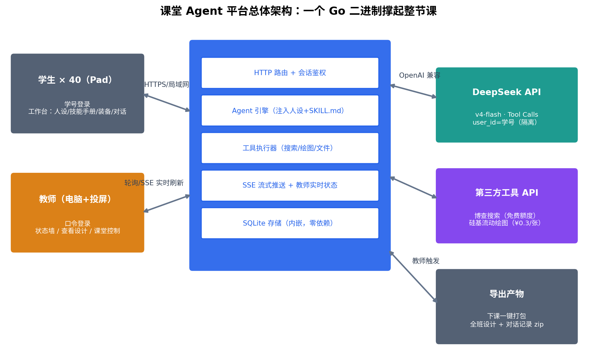

# 课堂 Agent 平台 · 初步设计方案

> **一句话设计哲学**：一个 Go 二进制 + 一个 SQLite 文件，拷到任何一台能联网的机器上双击就跑；学生的全部体验收敛在一个页面里，教师的全部管理收敛在另一个页面里。
>
> 配套文档：《Agent概念辨析与公开课自建Agent平台调研报告.md》（概念与成本依据）

---

## 1. 总体架构



**选型决策与理由**：

| 决策 | 选择 | 理由 |
|---|---|---|
| 后端 | Go 单二进制（`net/http` + `chi` 轻路由） | 编译出一个 exe/二进制即可部署，学校机器无环境依赖；goroutine 天然适合 40 路并发 SSE |
| 前端 | 内嵌静态页（`embed.FS`），原生 JS + 少量 CSS，不引入构建链 | Pad 浏览器直接访问；改页面不用装 node；单二进制分发 |
| 数据库 | SQLite（`modernc.org/sqlite`，纯 Go 无 cgo） | 零部署、单文件、可备份可拷走；40 人量级性能绰绰有余 |
| 实时推送 | Fetch 流 + SSE（Server-Sent Events） | 学生对话用 `fetch(POST)` 流式读取；锁定广播、教师状态墙和大屏切换用 SSE，均为服务端单向推送 |
| LLM | DeepSeek API（OpenAI 兼容 SDK 直连） | v4-flash 并发 2500，成本 ¥4/节课 |
| 部署 | 一台 2C4G 云主机（推荐）或教室电脑 | 云主机可避免校园网端口限制；Pad 走 HTTPS 访问域名 |

**关键安全边界**：DeepSeek Key、第三方 API Key 全部只在服务端；不把学号、姓名直接传给模型服务。DeepSeek 的 `user_id` 使用服务端生成的匿名标识（如 `HMAC-SHA256(run_id + student_id)` 的截断值），仅用于官方支持的内容安全、缓存和调度隔离；本地数据库仍用学号关联学生记录。

---

## 2. 角色与鉴权

### 2.1 学生端：学号登录（零注册）

- 课前你把班级名单做成一个 `students.csv`（学号,姓名），启动时导入或放在 `data/` 目录自动加载；
- 学生打开网页只有一个输入框：**输入学号 → 进入工作台**。首次登录写 session cookie，刷新不掉线；
- 可选加固：学号 + 姓名第一个字做二次校验，防邻座互登（课堂恶作剧第一高发区）；
- 同一学号重复登录时，后登录顶掉前者并提示——防止两个 Pad 同时写一份设计。

### 2.2 教师端：口令登录

- 启动参数或环境变量设置教师口令（如 `-admin-password=xxx`）；
- `/teacher` 路径 + 口令 → 进入管理台。口令不进代码库、不进前端。

---

## 3. 学生端：工作台页面设计

整个学生端只有**一个页面**，从上到下四个区，符合"拨四个旋钮"的教学设计：

```
┌─────────────────────────────────────────┐
│  🎓 我的 Agent 工作坊        学号:2101 张三 │
├─────────────────────────────────────────┤
│ ① 它是谁？（人设）                        │
│ ┌─────────────────────────────────────┐ │
│ │ 你是一位严格的初中数学出题老师……      │ │
│ └─────────────────────────────────────┘ │
│ ② 它的本领秘籍（技能手册 SKILL.md）        │
│ ┌─────────────────────────────────────┐ │
│ │ [使用模板✏️] # 技能：出一份好的数学小测 │ │
│ │ ## 什么时候用……（填空式模板）          │ │
│ └─────────────────────────────────────┘ │
│ ③ 给它装备：  [✓]🧮计算器                 │
│              [ ]🌐能上网（后续版本）       │
│ ④ 最大步数: ──────────────●──── 45 / 60   │
├─────────────────────────────────────────┤
│ 💬 对话区                                 │
│ ┌─────────────────────────────────────┐ │
│ │ 任务：给我出一套二元一次方程小测       │ │
│ │ 🤖 ……（流式输出）                     │ │
│ │ ▸ 查看 AI 的"行动记录"（1 次工具调用）  │ │
│ └─────────────────────────────────────┘ │
│ [输入框………………………………] [发送]      │
└─────────────────────────────────────────┘
```

设计要点：

- **「使用模板」按钮**：一键插入你预置的填空式 SKILL.md 模板（出题官/周报小编/辩论教练三套可选），学生改模板而不是面对空白页——这是防冷场的关键；
- **装备勾选**即工具白名单，界面不出现"Function Calling"等术语，叫"装备"。v0.1 只提供一个安全、无外部依赖的计算器；学生可以观察 Agent 什么时候选择使用它、什么时候直接回答；
- **「行动记录」折叠面板**：它不是购物或付费记录，而是 Agent 调用工具的过程记录。例如“第 1 步：AI 请求使用计算器，输入 `23*17` → 平台执行 → 返回 `391`”。默认显示这类易懂摘要；展开“查看技术细节”后才显示原始 tool_call JSON。这是"弱化但不隐藏"的落点；
- **每改一次①~④，右上角出现「保存设计」**，保存成功 = 在教师端状态墙上点亮；
- **课堂任务使用纸质任务卡**，平台不承担任务发布和同步，减少课堂对网络与界面的依赖。

---

## 4. 教师端：管理台页面设计

教师端一个页面，三个视图切换。

### 4.1 状态墙（默认视图，投屏用）

40 个格子实时刷新（SSE 推送，无需手动刷新）：

```
┌────────┐ ┌────────┐ ┌────────┐ ┌────────┐
│ 2101   │ │ 2102   │ │ 2103 ⚫ │ │ 2104   │
│ 张三   │ │ 李四   │ │ 王五   │ │ 赵六   │
│ 人设 ✓ │ │ 人设 ✓ │ │ 未登录  │ │ 人设 ✓ │
│ 手册 ✓ │ │ 手册 … │ │        │ │ 手册 ✓ │
│ 💬12轮 │ │ 💬3轮  │ │        │ │ 💬8轮  │
│ 🟢活跃  │ │ 🟡 idle│ │        │ │ 🟢活跃 │
└────────┘ └────────┘ └────────┘ └────────┘
```

每个格子一眼回答四个问题：**来了没、写了没、聊了没、还活着没**（最后活跃时间 >3 分钟标黄）。点格子 → 进入个体视图。

### 4.2 个体视图（看设计 + 看对话）

左栏展示该生的完整设计（人设、SKILL.md、装备、步数），右栏是他的实时对话流（含 tool_call 记录）。两个按钮：

- **「投屏展示」**：把这位学生的设计 + 最佳一轮对话推到大屏专用视图（大号字体、隐藏学号保留姓名、隐藏 token 等管理信息）——公开课"展示学生的设计"环节就靠它；
- **「放进优秀池」**：标记后进入轮播名单。

### 4.3 课堂控制栏（页面顶部常驻）

| 控制 | 作用 | 课堂场景 |
|---|---|---|
| **全体锁定/解锁** | 通过学生事件流一键冻结所有学生的发送按钮（保留查看），服务端同时拒绝新的 `/api/chat` 请求 | 教师讲解时快速暂停全班操作 |
| **随机点名** | 从已保存设计的学生中随机抽一位投屏 | 展示环节的悬念感 |
| **优秀作品轮播** | 大屏自动轮播"优秀池"中的设计 | 课堂收尾 |
| **新建场次** | 创建新的 `run_id`，切换到一份空白课堂数据；旧场次保留、可导出 | 下一次试讲或公开课开始前 |
| **导出打包** | 全班设计 + 对话记录 + 生成图片打包 zip 下载 | 留作教学档案/评课材料 |

---

## 5. 数据模型（SQLite，面向少量公开课）

平台不做长期运营所需的完整“学校—班级—课程”体系，只增加一个轻量 `run_id` 表示一次试讲或公开课。每次上课前新建场次，所有学生数据自动落到当前 `run_id` 下；旧场次不做破坏性清空，导出后可以手动归档。

```sql
runs(id TEXT PRIMARY KEY, name TEXT, status TEXT, locked INT,
     created_at, ended_at)
students(run_id TEXT, id TEXT, name TEXT, created_at,
         PRIMARY KEY(run_id, id))
sessions(token TEXT PRIMARY KEY, run_id TEXT, student_id TEXT,
         is_teacher INT, expires_at)
designs(run_id TEXT, student_id TEXT, persona TEXT, skill_md TEXT,
        tools TEXT,          -- v0.1 JSON: ["calculator"]
        max_turns INT, updated_at,
        PRIMARY KEY(run_id, student_id))
messages(id INTEGER PRIMARY KEY AUTOINCREMENT, run_id TEXT,
         student_id TEXT, turn_id TEXT,
         role TEXT,            -- user/assistant/tool
         content TEXT, tool_calls TEXT, created_at)
usage(run_id TEXT, student_id TEXT, tokens_in INT, tokens_out INT,
      images INT, searches INT, estimated_cost REAL,
      PRIMARY KEY(run_id, student_id))
```

`turn_id` 表示学生点击一次“发送”所产生的完整 Agent 回合，把用户消息、工具调用和最终回答串在一起，因此当前范围不需要再引入完整的多会话模型。学生刷新或重新登录时继续读取自己在当前场次下的数据；同一学号后登录仍会顶掉前一个 session。

`usage` 表是教师端"成本仪表盘"和超预算熔断的数据来源。记忆、图片和文件属于后续版本，等真正实现相应工具时再增加表或受控文件目录，v0.1 不预先设计空结构。

---

## 6. API 一览

| 方法 | 路径 | 说明 |
|---|---|---|
| POST | `/api/login` | 学号（+姓氏首字）登录，发 session cookie |
| POST | `/api/teacher/login` | 教师口令登录 |
| GET | `/api/design` | 拉取自己的设计（刷新恢复） |
| PUT | `/api/design` | 保存设计（人设/SKILL.md/装备/步数） |
| POST | `/api/chat` | 发消息，浏览器用 **Fetch ReadableStream** 读取流式响应：先推 tool_call 事件（供“行动记录”面板），再推正文 token |
| GET | `/api/events` | 学生端 SSE：连接时下发当前锁定状态，之后接收全体锁定/解锁事件 |
| GET | `/api/memory` | （v0.2）查看"AI 记住了我什么"（教学透明化） |
| GET | `/api/teacher/wall` | SSE：全班状态墙实时流 |
| GET | `/api/teacher/student/{id}` | 某生设计 + 对话 |
| POST | `/api/teacher/lock` `{locked: true}` | 全体锁定/解锁 |
| POST | `/api/teacher/spotlight` `{id}` | 投屏展示某生 |
| POST | `/api/teacher/run` | 新建并切换公开课场次 |
| GET | `/screen` | 返回大屏 HTML 页面，教室电脑浏览器全屏打开 |
| GET | `/api/screen/events` | 大屏页使用的 SSE，跟随 spotlight/轮播切换 |
| GET | `/api/teacher/export?run_id=...` | （v0.2）按场次打包 zip 下载 |

大屏 `/screen` 是一个独立页面：教室电脑接投影全屏开着它，页面再连接 `/api/screen/events`。教师在自己 Pad/手机上点"投屏展示"即可切换内容，不用碰教室电脑。

学生对话流和课堂广播刻意分开：`POST /api/chat` 只在一次回答期间保持连接；`GET /api/events` 是一个很轻的常驻连接，目前只广播锁定状态。纸质任务卡不经过平台。

---

## 7. Agent 引擎（服务端核心，约 150 行 Go）

```
收到 /api/chat
  ├─ 检查：全体锁定？该生超预算？→ 拒绝并提示
  ├─ 组装 system prompt = 人设 + SKILL.md（v0.2 再按需加入记忆）
  ├─ 组装 tools = 按"装备"勾选注入工具定义（v0.1 只有 calculator）
  └─ 循环（最多 max_iterations 次，课堂默认 5）：
       ├─ 调 DeepSeek（user_id=服务端生成的匿名标识）
       ├─ 无 tool_call → SSE 推正文，结束
       └─ 有 tool_call → 推送"行动记录"事件 → 校验参数并在本地执行工具
                         → 结果追加进 messages → 继续循环
  └─ 收尾：usage 记账；v0.1 不做长期记忆
```

**防翻车五条**（写死在引擎里）：

1. LLM 并发信号量（如 40），每名学生同时只允许一个 `/api/chat` 请求，防重复发送和预算竞态；
2. `max_iterations` 限制模型往返次数，`max_tool_calls` 限制本轮工具调用总数；计算器参数只接受受限的数学表达式，不执行脚本或任意代码；
3. 每生 token 预算默认 20 万，约为当前测算均值 16.1 万的 1.24 倍，超了提示联系老师；
4. 单次 DeepSeek 调用设置超时；仅在尚未产生任何流式输出时允许重试一次，失败返回友好文案而不是 500；
5. v0.1 暂不建设关键词黑名单或复杂内容审核，但限制输入、人设、技能手册和单次输出长度。前端把学生输入、模型文本和 tool_call JSON 均按纯文本渲染，不直接写入 `innerHTML`。

---

## 8. 目录结构

```
classroom-agent/
├── main.go              # 启动、路由、依赖注入
├── internal/
│   ├── auth/            # 登录、session、锁定状态
│   ├── agent/           # Agent 引擎（循环、prompt 组装）
│   ├── tools/           # calculator.go；后续再增加 web/draw/file/memory
│   ├── store/           # SQLite 六张表的 CRUD
│   └── teacher/         # 状态墙聚合、投屏、导出
├── web/                 # embed.FS 内嵌
│   ├── index.html       # 学生工作台（单页）
│   ├── teacher.html     # 教师管理台（单页）
│   └── screen.html      # 大屏投屏页
├── data/
│   ├── students.csv     # 学号,姓名（课前导入）
│   ├── templates/       # 3 套 SKILL.md 填空模板
│   └── app.db           # 运行时生成
└── config.yaml          # DeepSeek Key、预算和场次配置
```

工作量预估：AI 辅助生成的情况下，登录、设计保存、普通对话和状态墙的演示骨架一个周末可以跑通；加入计算器 Agent 循环、锁定广播、场次隔离、异常处理和真实设备联调后，建议为可上公开课的 v0.1 预留 **5~7 个完整工作日**。

---

## 9. 分期实施路线

| 版本 | 内容 | 对应课堂环节 | 工作量 |
|---|---|---|---|
| **v0.1（必须）** | 学号登录、人设+SKILL.md 编辑与模板、计算器装备、Agent 工具调用循环、"行动记录"、保存设计、场次隔离、教师状态墙+个体查看+投屏、全体锁定 | 纯对话与 Agent 的 A/B 对比、亲眼看到“模型下指令、代码做计算”、展示设计 | 5~7 个工作日（含联调） |
| **v0.2（推荐）** | 记忆开关 + "AI 记住了我什么"查看页、导出打包、随机点名 | 记忆体验环节、课后留档 | +1~2 天 |
| **v0.3（彩蛋）** | 联网搜索 + 绘图工具、受控文件工具、更多工具限额 | 升维演示、学有余力学生的探索 | +3~5 天 |
| v0.4（可选） | 多智能体演示模式（你预置的 编排者+三专才 demo，只演示不开放编辑） | 收尾的"升维"8 分钟 | +1 天 |

**建议**：公开课先确保 v0.1 稳定。计算器已经足够展示真正的 tool call 循环，不必为了“像 Agent”而强行接入搜索和绘图。v0.2 做完则加入；v0.3 做不完时，用教师账号单独演示外部工具即可。

---

## 10. 课前 checklist（公开课当天）

- [ ] 提前 3 天：用 50 个模拟学生压测登录、保存、聊天、锁定广播和 SSE 重连；再用 10~15 台真实 Pad 在上课教室联调 Wi-Fi
- [ ] 提前 1 天：确认 DeepSeek 余额；只有启用 v0.3 时才需要充值硅基流动并检查博查额度
- [ ] 当天课前：新建场次、导入本班 students.csv、改教师口令、确认纸质任务卡已发、大屏页全屏待命
- [ ] 兜底包：本地存好「平台操作录屏 + 预跑的对话截图」，断网时课照上
- [ ] 课后：一键导出 zip，留作评课与教学档案
